# My Portfolio Website

Personal portfolio site for **Ashish Pal**, Cloud & DevOps Engineer (Azure, Terraform, CI/CD, GenAI). A single-page static site with an interactive resume, filterable project gallery, an AI chat assistant, a web-shell terminal, and a full neubrutalist theme switch.

**Live site:** [ash-21.netlify.app](https://ash-21.netlify.app/) · **Demo video:** [Watch on Drive](https://drive.google.com/file/d/1leoTsAZGnbtX2eCMI_B49IyalKVDMQgr/view?usp=drive_link)

---

## Features

### About
Sidebar profile with contact details and socials, a "What I'm Doing" grid, and a live-embedded LinkedIn achievement post.

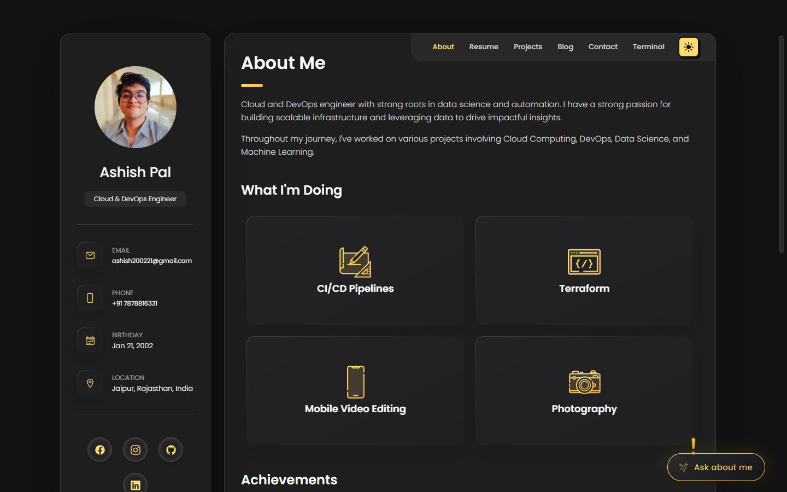

### Resume — Portfolio View
Education and experience timelines, plus an interactive physics-based skills canvas (drag/tap the icons) backed by a dual-direction infinite marquee of every tool in the stack.

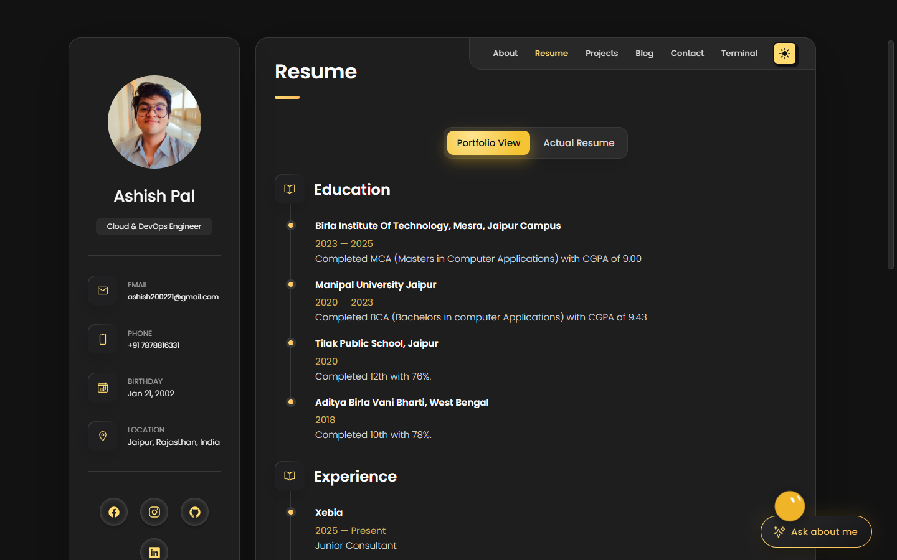
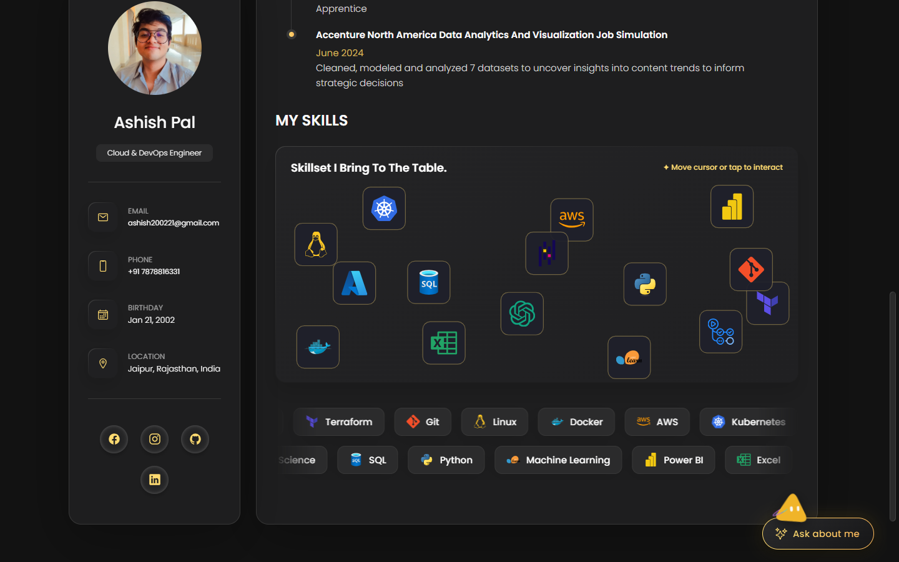

### Resume — Actual Resume
Toggles to a native in-page PDF viewer of the downloadable resume, with a PDF.js fallback for mobile.

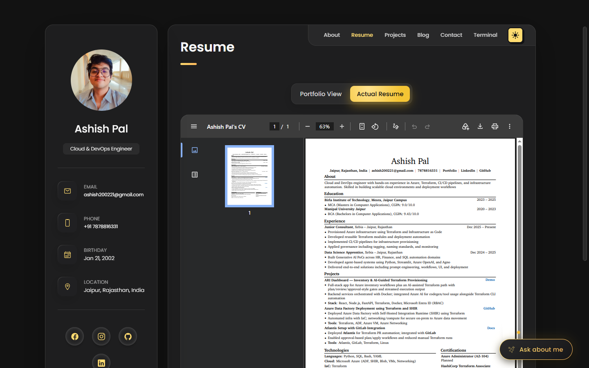

### Projects
Filterable project grid (All / Machine Learning / Power BI / Excel / SQL / GenAI / Cloud) covering AI agents, data analysis, and cloud automation work.

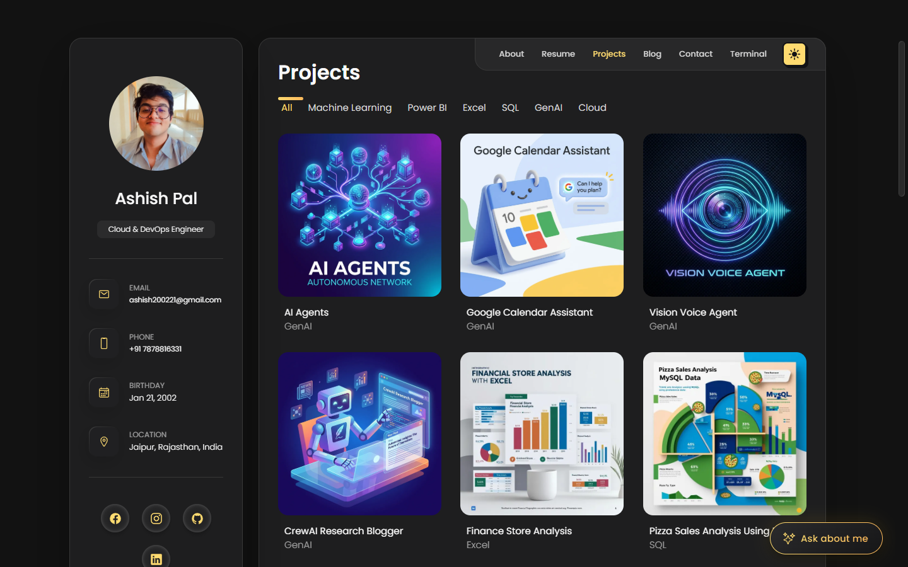

### Blog
Card-based index linking out to technical write-ups.

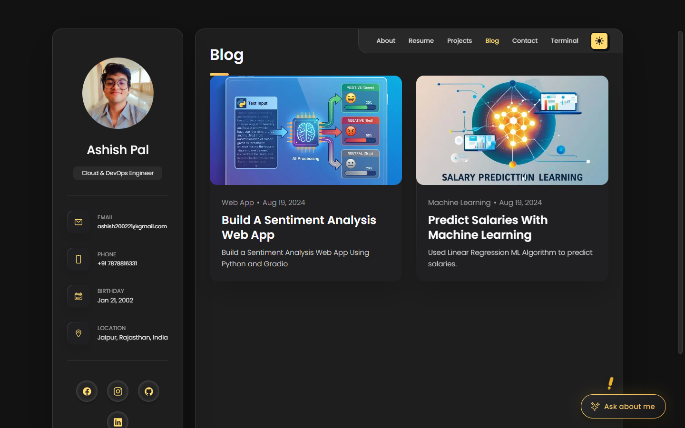

### Contact
A working contact form wired to a Netlify function.

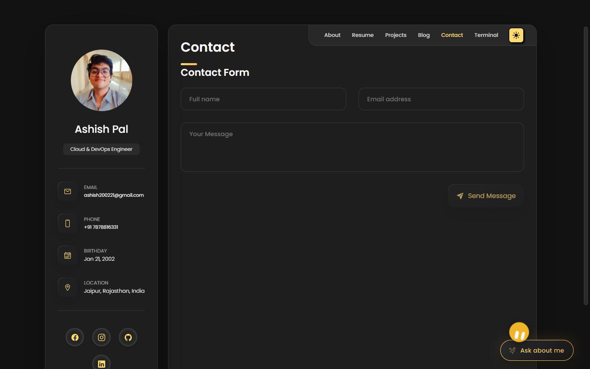

### Terminal
An embedded, interactive web-shell (`whoami`, `projects`, `contributions`, `matrix`, `help`, `clear`) for exploring the profile in command-line form.

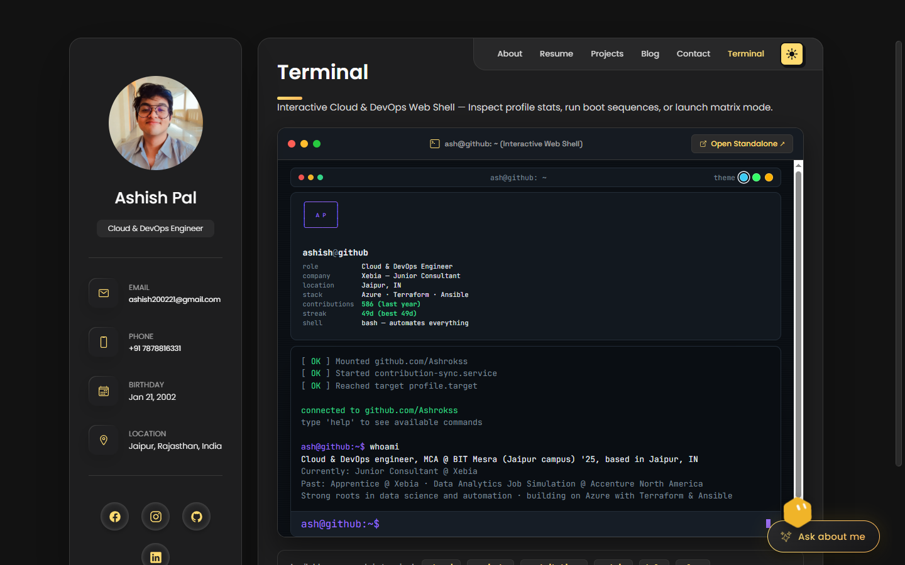

### Ask AI — chat assistant
Floating chat widget that answers visitor questions about Ashish's background, projects, and skills, backed by a Netlify function that calls Groq with a Gemini fallback.

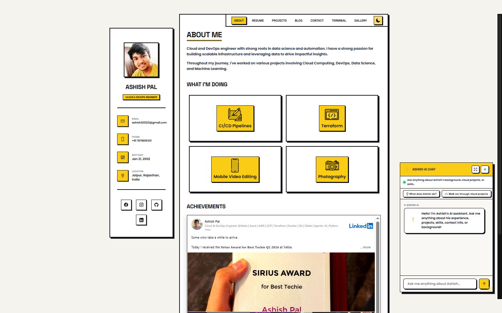

### Brutal Mode
A one-click, full-site neubrutalist theme swap (thick borders, hard shadows, high-contrast yellow/black) with a dedicated photo Gallery that only appears while it's on.

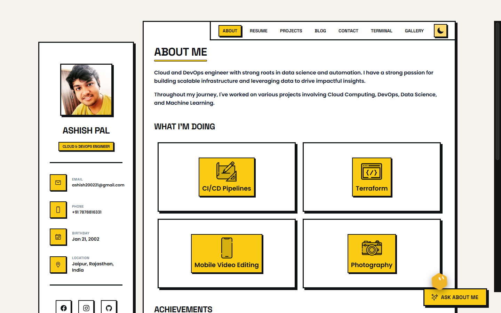
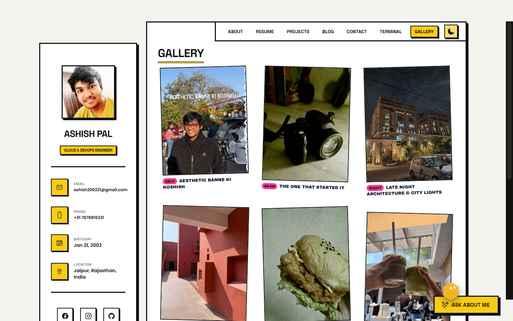

---

## Tech stack

- **Frontend:** Vanilla HTML/CSS/JS — no framework, no build step
- **Backend:** Netlify Functions (`netlify/functions/chat.mjs`, `bio.js`) proxying to Groq, with a Gemini fallback
- **PDF rendering:** PDF.js for mobile resume rendering
- **Hosting:** Netlify
- **Tests:** Node's built-in test runner (`node --test`) covering the chat function fallback logic and the skills canvas/marquee markup

## Running locally

This is a static site — no build step required.

```bash
# serve the site
npx serve .
# or
python -m http.server 8000
```

The AI chat widget and contact form call Netlify Functions, so they only work when served via `netlify dev` (requires `GROQ_API_KEY` / `GEMINI_API_KEY` in `.env`):

```bash
netlify dev
```

## Tests

```bash
node --test tests/
```

## Project structure

```
index.html                 # single-page app — all sections/pages live here
assets/
  css/                      # base styles + brutal.css (theme)
  js/                        # script.js (core UI), brutal.js (theme + gallery)
  images/, resume/
netlify/functions/          # chat.mjs (Groq + Gemini fallback), bio.js
tests/                       # node --test suite
```
